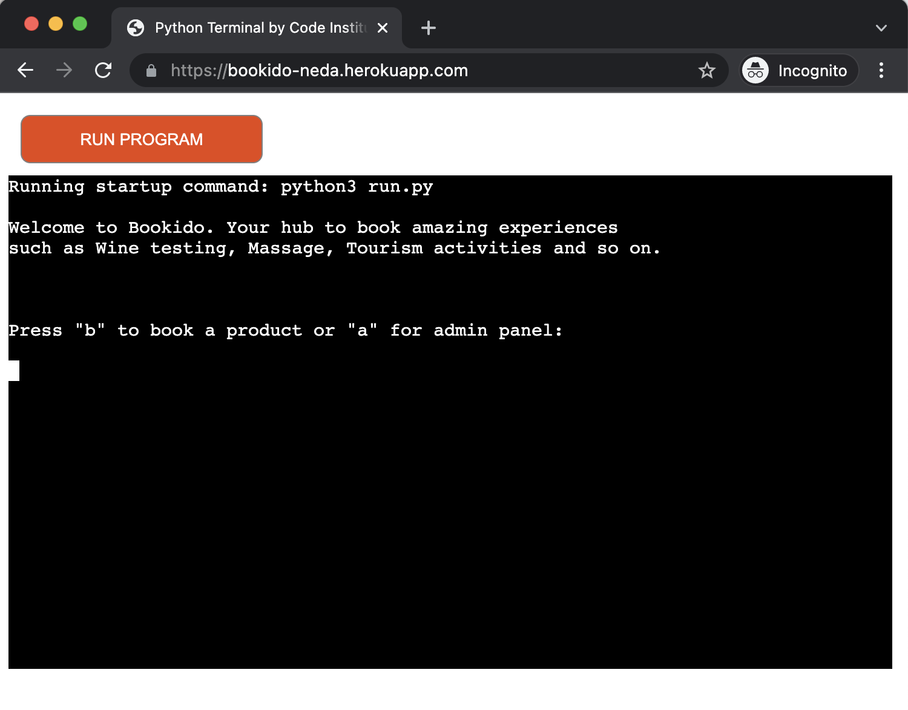

# Bookido

Developer: Neda Keshavarzi

Bookido is a service to create new products and services and also be able to book them.

-   [Deployed page](https://bookido-neda.herokuapp.com/)
-   Here is the [Google spreadsheet](https://docs.google.com/spreadsheets/d/1hKOv1GdSr1bF002IpUSvh7Rn2FCdkRzueiZbj2DBGPs/edit?usp=sharing) that acts as the datastore for this project.
-   Here is the [Google Calendar](https://calendar.google.com/calendar/embed?src=l3pgnrii459d7a696a9pb0fcco%40group.calendar.google.com&ctz=Europe%2FStockholm) that holds the events that are created when you create a new product.

## Table of Content

1. [Project Goals](#project-goals)
2. [User Goals](#user-goals)
3. [Structure](#structure)
    1. [Home Screen](#1-home-screen)
    2. [Booking a Product](#2-booking-a-product)
    3. [Admin section](#3-admin-section)
    4. [Booking Schedule](#4-booking-schedule)
4. [User Stories](#user-stories)
    1. [Customer User Stories](#customer-user-stories)
    2. [Admin Member User Stories](#admin-member-user-stories)
    3. [Site Owner Goals](#site-owner-goals)
5. [Technical Design](#technical-design)
    1. [Flow Chart](#flowchart)
    2. [Data Models](#data-models)
    3. [User Interface](#user-interface)
6. [Features](#features)
    1. [Feature 1: The Product Booking System](#feature-1-the-product-booking-system)
    2. [Feature 2: The Schedule](#feature-2-the-schedule)
    3. [Feature 3: The Admin section](#feature-3-the-admin-section)
    4. [Features to be implemented](#features-to-be-implemented)
7. [Technologies Used](#technologies-used)
    1. [Languages](#languages)
    2. [Applications, Platforms and Libraries](#applications-platforms-and-libraries)
        1. [Applications and Platforms](#applications-and-platforms)
        2. [Python Libraries](#python-libraries)
        3. [Third Party Libraries](#third-party-libraries)
8. [Validation](#validation)
9. [Bugs](#bugs)
10. [Deployment](#deployment)
    1. [Heroku](#heroku)
    2. [Google API](#google-api)
11. [Credits](#credits)
12. [Acknowledgments](#acknowledgments)

## Project Goals

Create a SAS service that the owner can add products and services and customers can book those product and services. The scope is wide in a sense that the products and services can be anything from a meal in a restaurant to a service like massage, tourism, booking a hotel or any kind of event that can be scheduled.

## User Goals

Users should be able to book their desired product or service via the interface of this product.

### Target Audience

-   General public
-   Tourism, Hotels and service providers providing service to the public.

## Structure

The Bookido Booking System is a command prompt based system that gets inputs from users to book a product and also create new products. It extensively relies on user input to be able to store given data in the product catalog and also user information to the products when a user books a service or a product.

### 1. Home Screen

    
Click here to view the home screen

The first thing that the user sees when starting the application is a welcome message and the options to choose what to do.

-   Book a product - It takes the user to book their desired product that is in the system.
-   Admin section - takes users to the admin section where they can create a new product.

### 2. Booking a product

    
Click to view image

Users will be taken in the process of booking a product which leads to their email being stored in the data store, Google spreadsheet, and ultimately adding them to the Google calendar event summary section.

### 3. Admin section

Admins of Bookado can enter the admin section via a password and after logged in, they can add new products.

    
Click to view image

### 4. Booking Schedule

Each product while getting created need to have defined date, time and duration. if duration not set it will default to 45 minutes. This leads to creation of a Google calendar event with the respective information of that product.

    
Click to view image

## User Stories

### Customer User Stories:

1. As a user, I would like to book a product that is available in the system
1. I would like to be notified if I have entered the correct data
1. I would like to be able to confirm my booking before it happens.
1. I would like to get a confirmation of my booking with proper information about the product I booked.
1. I would like to cancel my booking at any time during the booking process.
1. I would like to go to the main menu anytime during the application flow

### Admin Member User stories:

1. As an admin, I would like to create products in the system
1. As an admin, I would like the products that are created to be stored in the data store, Google spreadsheet
1. As an admin, I would like to have a Google calendar event based on the information added when creating a product
1. As an admin, I would like the description of the Google calendar event summary be updated with the email address and number of users booked
1. As an admin, I would like the product catalog to be updated by the email address of customers who booked a given product

### Site Owner Goals

I would like for the application to contain validated Python code without returning any errors, whatever the user does

## Technical Design

### Flowchart

Below is a flowchart describing the structure of the application, created with [Lucidchart](https://lucid.co/product/lucidchart).

    
View flowchart here

### Data models

There are two main data models used in this project. First one is the **Product** model which holds information about a product in the system and the other one is **ProductRow** which holds the **row_number** of a product in Google spreadsheet that can be used to update a product in the sheet.

These models will be converted to Python dict at the time of storage and also the data retrieved from the spreadsheet in the form of Python dict will be converted to Pydantic data models to be used more reasily and properly throughout the application.

### User interface

The user interface is in the from of command prompt and command line input. It's very important that the system shows proper and enough information to the user to be able to decide on which flow to take and also what direction to go to.

## Features

### Feature 1: The Product Booking System

This is the main feature of the application. Products information in the system get shown to the user and their email address is taken to book the product.

The flow is as follow:

1. Customer will be presented with the list of products available in the system
1. If a products date is in the past that product will not be shown to the customer
1. When the customer chooses a product, the information about that product is shown including summary and the date.
1. If the customer confirms by choosing continue, their email address is asked.
1. After their email address is taken and validated, system will save their information in the spreadsheet and also add their email to the Google event calendar summary to be viewed by the admin.
1. Finally a confirmation is shown to the user with the date of the product so that they can take note of that.

  
Click to view images of feature 1

_Booking confirmation_

_Entry in Google Sheets_

### Feature 2: The Schedule

When a product is created by an admin, the date, time and duration is asked. Based on these information along with the title and summary of the product, a Google calendar event is created. This will be the key for the admin to view who has booked a product by looking at Google calendar of the company for this service.

    
Click to view images of feature 2

_Google Calendar entry_

### Feature 3: The Admin section

This section is where an admin can add a new product. information about a new product is asked from the admin. This information includes following:

-   title
-   description
-   address
-   capacity
-   price
-   date and time

The system will generate unique ids for both the product and also for the calendar_id that will be used to create the Google calendar event.
On successful product creation, admin will be presented with a confirmation.

    
Click to view images of feature 3

### Features to be implemented

One feature that would be great to have is to be able to create reccuring products in that instead of having one slot available for a product to be booked, a reccuring event can be setup for the customers to choose from.
Also it would be great to create a reminder event on the customers calendar when they book a product.

## Technologies used

### Languages

-   [Python 3](https://www.python.org/) - Was used solely to create this project.

### Applications, Platforms and Libraries

#### Applications and Platforms

-   [Git](https://git-scm.com/) - Version control system used to commit and push to Github via Gitpod.

-   [Github](https://github.com/) - The projects repository and all its branches were commited, pushed and deployed to Github.

-   [Gitpod](https://gitpod.com/) - All code was written and tested using the Gitpod web-based IDE.

-   [Heroku](https://www.heroku.com) - Used to deploy the application.

-   [Lucidchart](https://lucid.co/product/lucidchart) - Lucidchart was used to create the [flowchart](#flowchart) of the project.

-   [Google Calendar](https://calendar.google.com/) - The users input data creates and edits events on Google Calendar

-   [Google Sheets](https://calendar.google.com/) - - The users input data creates and edits content on Google Sheets

-   [Google Cloud Platform](https://console.cloud.google.com/) - All data send and received with the help of the Google API, through the Google Cloud Platform

#### Python Libraries

I have used these third party libraries and Python libraries for this project:

-   datetime: As time is of essence when working with calendars, this was essential.

-   os: By using os I was able to both have my password in the workspace without pushing it to github, but also use it as a config var on heroku.

-   re: to be able to validate using regular expressions

-   uuid: to generate universally unique ids

-   pydantic: Data validation and settings management using python type annotations.

#### Third Party Libraries

-   googleapiclient.discovery: needed to work with the Google API

-   google.oauth2.service_account: So the application can access the account that the sheet and calendar are on with the credentials

-   gspread: so the application can read Google Spreadsheets

## Validation

All Python files passed the [PEP8](http://pep8online.com/) tests with 0 errors except sheet.py. Since Pydantic is used, PEP8 shows an error but it's not really an error.

    
View validations here

gcalendar module

utils module

run module

sheet module

## Bugs

    
View bugs and fixes

___

**Bug**: When booking a product, user could see products that were scheduled in the past

**Fix**: Filter the products that have a date/time in future

---

**Bug**: When admin entering a wrong password, nothing would happen

**Fix**: Let the admin try 3 times and if wrong password entered, go to main screen

---

**Bug**: Duration for products were not set and hence Google calendar event creation was failing

**Fix**: Ask duration as input when creating a new product by admin

---

**Bug**: When there is no product to show, it was not displaying any useful message

**Fix**: Display a message that there is no product to book at the moment. If you are an admin, add new products

---

**Bug**: When user enters empty values, when adding a new product, application breaks

**Fix**: Add valiation functions to check that the values of the inputs are not blank

---

**Bug**: When user enters a product number to book, they can enter empty or not a number and that breaks the application

**Fix**: Add valiation functions to check that the value of the product seleection iniput is not empty or not a number

---

## Deployment

### Heroku

This application has been deployed from Github using Heroku. Here's how:

1. Create an account at [heroku.com](https://heroku.com/)
2. Create a new app, add app name and your region
3. Click on create app
4. Go to "Settings"
5. Under Config Vars, add creds.json content and define the ADMIN_PASSWORD env variable.
6. For this project, I set buildpacks to <Python> and <NodeJS> in that order.
7. Go to "Deploy" and at "Deployment method", click on "Connect to Github"
8. Enter your repository name and click on it when it shows below
9. Choose the main branch.
10. If desired, click on "Enable Automatic Deploys", which keeps the app up to date with your Github repository.

### Google API

Here's how you can set up your own API:

1. Login or create a Google account and navigate to https://console.cloud.google.com/
2. Create a new Project by clicking on the New Project icon
3. Add Project name and details
4. Enable Google drive, Google sheets and Google calendar APIs
5. IF the API requires, create a credential (service account in this case) for the project
6. Download the credential and upload it to your workspace a a json-file
7. Get help from documentation for each of the APIs used, e.g calendar API: [Google Calendar API Reference](https://developers.google.com/calendar/api/v3/reference?hl=en)

## Credits

Here are links to sites that answered a lot of my questions on coding and the Python language.

### Coding tips and tricks

Overriding false errors when Flake and Pylint validate code:

Using the python datetime library: [docs.python.org](https://docs.python.org/3/library/datetime.html)

Regular expression for validating email: [Stack Overflow](https://stackoverflow.com/questions/8022530/how-to-check-for-valid-email-address)

### Acknowledgments

This project was created from a template made by [Code Institute](https://codeinstitute.net/) to recreate the terminal in a regular web browser.
I would like to thank my mentor, Mo Shami for all the support I got during this project.
